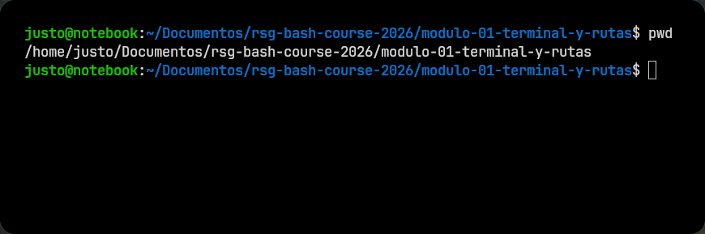
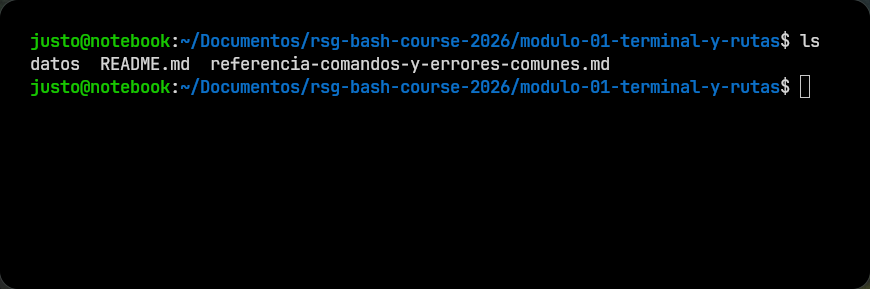
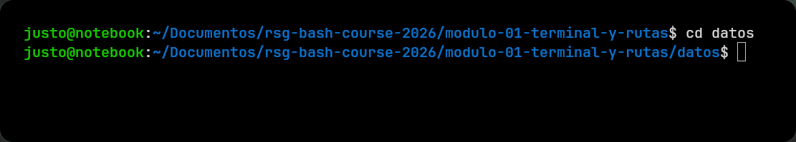
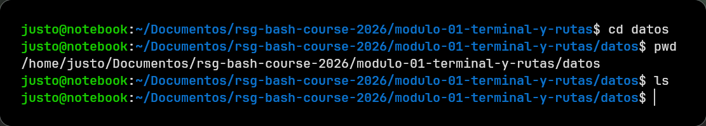
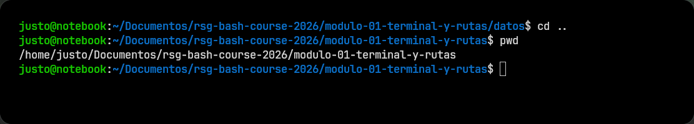

# Módulo 01: Terminal Y Rutas

> [!CAUTION]
> Para esta clase, asumí que la terminal ya está abierta en la carpeta del proyecto.
> Si necesitás abrirla desde el explorador de archivos, una opción práctica es hacer clic derecho sobre la carpeta del proyecto y abrir la terminal desde ahí.

## Conceptos básicos al escribir comandos

Antes de avanzar, conviene fijar algunas reglas simples de lectura y escritura en terminal.

Los comandos suelen escribirse en minúsculas y respetando espacios entre sus partes. En general, se pueden pensar con esta estructura:

```text
comando [opciones] [argumentos]
```

- **comando**: lo que queremos ejecutar, por ejemplo `ls`, `cd` o `pwd`
- **opciones**: modifican el comportamiento del comando, por ejemplo `-l`
- **argumentos**: indican sobre qué archivo, carpeta o valor trabaja el comando

### Ejemplo rápido

```bash
ls -l datos
```

En ese caso:

- `ls` es el comando
- `-l` es una opción
- `datos` es un argumento

## Algunas ideas útiles desde el principio

- La terminal distingue mayúsculas de minúsculas.
  `File.txt` y `file.txt` no son lo mismo.
- La tecla de tabulación puede ayudar a autocompletar nombres de archivos o carpetas.
  Esto reduce errores de tipeo.
- El símbolo `#` se usa para comentarios.
  La terminal lo ignora, y más adelante va a ser útil para documentar scripts.

## Archivos, carpetas y estructura

Si alguna vez usaste el explorador de archivos de tu computadora, esta idea ya la conocés.

Cuando abrís una carpeta en el explorador, adentro ves archivos y también otras carpetas. En terminal pasa exactamente lo mismo. La diferencia es que, en vez de entrar haciendo clic, te vas a mover escribiendo comandos.

En este curso usamos mucho la palabra *directorio*, porque es la forma más común de nombrar a una carpeta cuando trabajamos en terminal. No hace falta pensarlo como algo distinto: para este módulo, *directorio* y *carpeta* te sirven casi como sinónimos.

También ayuda pensar que las carpetas están anidadas unas dentro de otras. O sea: una carpeta puede contener otras carpetas, y esas a su vez pueden contener más cosas.

Por ejemplo, algo como esto:

```text
proyecto/
├── datos/
├── resultados/
└── notas/
```

## Primera parada: ¿dónde estoy?

Cuando abrís una terminal, siempre empezás en algún directorio, aunque todavía no lo veas con claridad.

Eso importa porque muchos comandos dependen de tu ubicación actual. No es lo mismo listar el contenido de una carpeta vacía que el de una carpeta con datos del análisis.

> [!IMPORTANT]
> En terminal no solo importa qué comando escribís, también importa desde dónde lo escribís.


### Probalo ahora

Corré:

```bash
pwd
```

<details>
<summary>Ver salida</summary>

</details>
Al ejecutar `pwd`, se imprime la ruta del directorio actual. En este módulo, debería mostrar una ruta que termina en `modulo-01-terminal-y-rutas`.

Por ahora alcanza con reconocer esto: `pwd` responde la pregunta **¿dónde estoy?**

## Segunda parada: ¿qué hay acá?

Una vez que sabés dónde estás, el paso siguiente es mirar qué hay en ese lugar.

### Probalo ahora

Corré:

```bash
ls
```

Por ejemplo, de correrlo en este módulo: 

<details>
<summary>Ver salida</summary>

</details>

## Qué es una ruta

Una ruta, o *path*, es la forma de escribir la ubicación de un archivo o directorio.

Por ejemplo, si un archivo está dentro de `datos/secuencias/archivo.fasta`, esa secuencia de nombres describe cómo llegar hasta él.

Las rutas sirven para movernos, listar contenido, copiar archivos o indicar exactamente sobre qué queremos trabajar.

## Entrar a una carpeta

Moverse entre directorios consiste en cambiar tu ubicación actual.

### Probalo ahora

Ahora usá `cd` para entrar a la carpeta `datos/` que vimos antes.

```bash
cd datos
```

<details>
<summary>Ver salida</summary>

</details>

Después corré otra vez:

```bash
pwd
ls
```

<details>
<summary>Ver salida</summary>

</details>

Qué mirar:

- `pwd` debería mostrar una nueva ubicación
- `ls` debería mostrar el contenido de esa carpeta

## Volver atrás

También necesitás poder deshacer un movimiento simple.

### Probalo ahora

Corré:

```bash
cd ..
```

Después verificá otra vez con:

```bash
pwd
```

<details>
<summary>Ver salida</summary>

</details>

Qué mirar:

- deberías haber vuelto al directorio anterior

`..` significa "subir un nivel" en la estructura de carpetas.

## Rutas absolutas y relativas

Hay dos tipos de rutas que vas a ver todo el tiempo.

- **Ruta absoluta**: describe una ubicación completa desde un punto fijo del sistema.
- **Ruta relativa**: describe una ubicación tomando como referencia el directorio donde estás ahora.

No hace falta dominarlo de inmediato. Lo importante ahora es ver una ruta relativa funcionando en un caso real.

### Probalo ahora

Sin moverte de más, entrá a una carpeta usando una ruta escrita desde tu posición actual.

Ejemplo:

```bash
cd modulo-01-terminal-y-rutas/datos
```

Qué mirar:

- no fuiste entrando carpeta por carpeta
- escribiste el recorrido completo desde donde ya estabas

Eso es una ruta relativa: se interpreta en relación con tu ubicación actual.

## Material de apoyo

> [!NOTE]
> En esta [guía rápida de comandos y errores comunes](referencia-comandos-y-errores-comunes.md) vas a encontrar un resumen con los comandos más usados y algunos errores frecuentes, además de cómo solucionarlos.


## Ejercicios adicionales

## Ejercicio 1

Usá `pwd` y `ls` en dos lugares distintos del proyecto y compará cómo cambia la salida.

## Ejercicio 2

Entrá a una carpeta, listá su contenido y volvé al directorio anterior sin cerrar la terminal.

## Ejercicio 3

Probá llegar a una misma carpeta de dos formas:

- entrando paso a paso
- usando una ruta relativa más larga

## Siguiente Paso

Cuando ya sabés dónde están los archivos, el paso siguiente es ordenar mejor el material del análisis.

Seguí en el [Módulo 02: Organizar archivos](../modulo-02-organizar-archivos/README.md).
