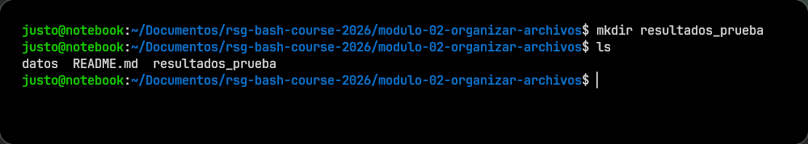
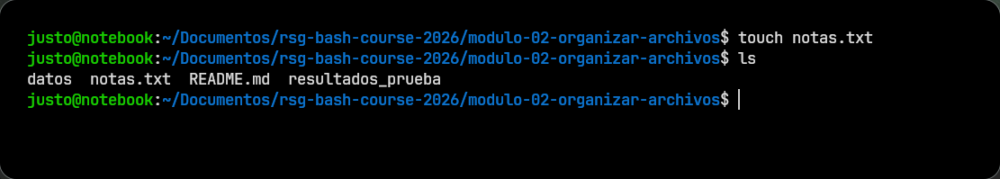
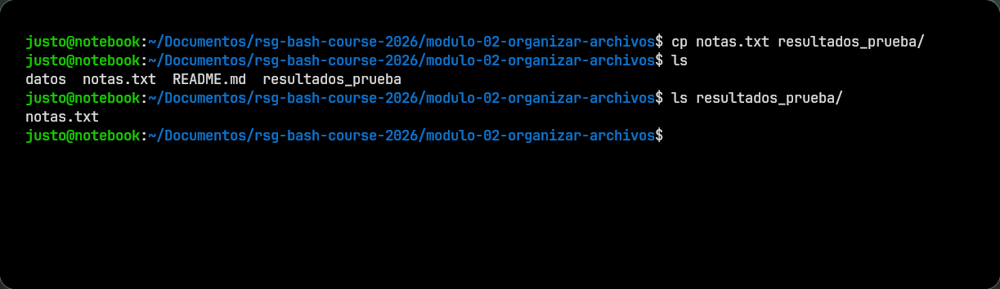
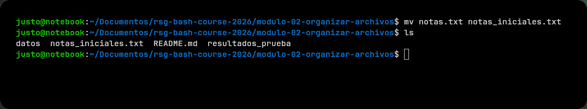
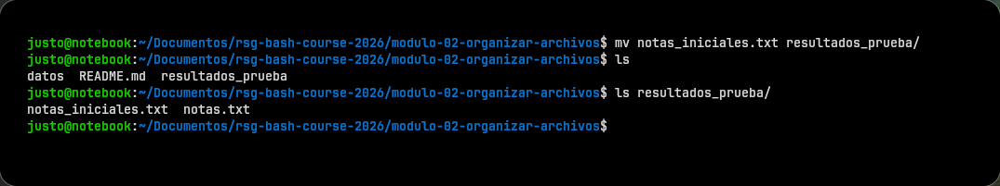

# Módulo 02: Organizar Archivos

## Teoría

## Antes de empezar

En bioinformática es muy común trabajar con varias clases de archivos al mismo tiempo: datos crudos, tablas, notas, scripts, resultados parciales y versiones viejas de cosas.

Si todo eso queda mezclado, después cuesta más encontrar lo importante y es más fácil cometer errores.

En este módulo vas a practicar operaciones básicas para ordenar un espacio de trabajo desde la terminal.

## Crear carpetas

Crear carpetas sirve para separar materiales y evitar que todo quede amontonado en un mismo lugar.

Por ejemplo, puede tener sentido crear carpetas como:

- `datos/`
- `resultados/`
- `notas/`

### Probalo ahora

Corré:

```bash
mkdir resultados_prueba
```

Después verificá con:

```bash
ls
```

<details>
<summary>Ver salida</summary>

</details>

Qué mirar:

- debería aparecer la carpeta `resultados_prueba`

## Crear archivos vacíos

A veces conviene crear un archivo vacío para dejar preparado un lugar donde después vas a escribir algo.

Para eso suele usarse `touch`.

### Probalo ahora

Corré:

```bash
touch notas.txt
```

Después verificá con:

```bash
ls
```

<details>
<summary>Ver salida</summary>

</details>

Qué mirar:

- debería aparecer `notas.txt`

## Copiar archivos

Copiar sirve cuando querés hacer una versión nueva sin perder la original.

Eso puede ser útil, por ejemplo, si querés guardar un respaldo antes de editar o mover algo.

### Probalo ahora

Corré:

```bash
cp notas.txt resultados_prueba/
```

Después verificá con:

```bash
ls
ls resultados_prueba
```

<details>
<summary>Ver salida</summary>

</details>

Qué mirar:

- `notas.txt` debería seguir existiendo en el lugar original
- también debería aparecer una copia dentro de `resultados_prueba`

**Idea clave:** copiar duplica; no saca el archivo de su lugar original.

## Mover archivos o renombrarlos

Mover y renombrar usan el mismo comando: `mv`.

Eso significa que con una sola herramienta podés:

- cambiar un archivo de carpeta
- cambiarle el nombre

### Probalo ahora

Corré:

```bash
mv notas.txt notas_iniciales.txt
```

Después verificá con:

```bash
ls
```

<details>
<summary>Ver salida</summary>

</details>

Qué mirar:

- `notas.txt` ya no debería aparecer
- en su lugar debería estar `notas_iniciales.txt`

Ahora probá moverlo:

```bash
mv notas_iniciales.txt resultados_prueba/
```

Y verificá con:

```bash
ls
ls resultados_prueba
```

<details>
<summary>Ver salida</summary>

</details>

Qué mirar:

- el archivo ya no debería estar en la carpeta actual
- sí debería aparecer dentro de `resultados_prueba`

## Borrar con cuidado

Borrar desde terminal puede ser muy directo. Por eso conviene hacerlo con atención.

- `rm` se usa para borrar archivos
- `rmdir` se usa para borrar directorios vacíos

### Probalo ahora

Si tenés un archivo de prueba que ya no necesitás, podés borrarlo con:

```bash
rm nombre_del_archivo
```

Y si tenés una carpeta vacía, podés borrarla con:

```bash
rmdir nombre_de_la_carpeta
```

Qué mirar:

- después de borrar, `ls` ya no debería mostrar ese archivo o carpeta

## Ejercicios adicionales

## Ejercicio 1

Creá una carpeta nueva para resultados y verificá que aparezca en el listado.

## Ejercicio 2

Creá un archivo vacío, copialo a otra carpeta y comprobá que exista en ambos lugares.

## Ejercicio 3

Renombrá un archivo de prueba y después movelo a otra carpeta.

## Ejercicio 4

Creá un directorio vacío, comprobá que está vacío y después borralo con `rmdir`.

## Siguiente Paso

Con el material un poco más ordenado, ya se puede abrir y leer los primeros archivos biológicos del caso.

Seguí en el [Módulo 03: Leer FASTA y TSV](../modulo-03-manejar-archivo-texto-plano/README.md)
