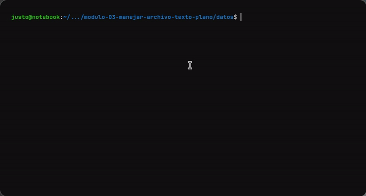
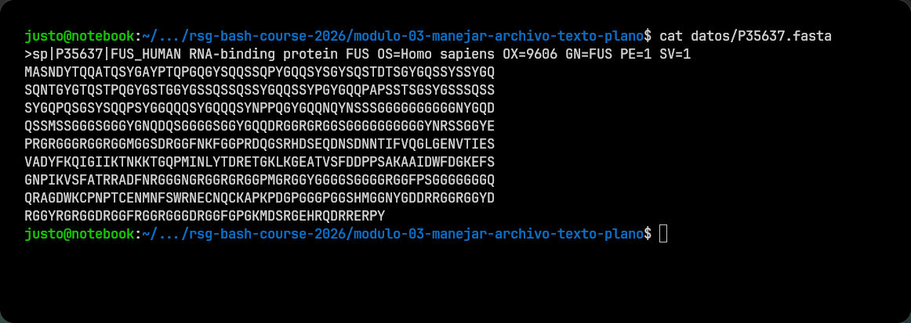

# Módulo 03: Manejar archivos de texto plano

## Teoría

## Trabajar con texto plano desde la terminal

Muchos archivos usados en ciencia de datos, bioinformática y otras áreas guardan su contenido como texto plano. Esto permite abrirlos, recorrerlos, buscar información y seleccionar partes de su contenido directamente desde la terminal.

En este módulo vas a aprender comandos para realizar esas tareas. Usaremos como ejemplos archivos FASTA y TSV, pero las mismas herramientas sirven para muchos otros archivos de texto.

Los archivos disponibles en `datos/` son:

- `datos/P35637.fasta`: un archivo corto
- `datos/rbps.fasta`: un archivo más largo
- `datos/rbps_especies.tsv`: una tabla separada por tabulaciones

## Editar archivos con nano

`nano` es un editor de texto que funciona dentro de la terminal. Resulta útil para hacer cambios rápidos sin abrir una aplicación gráfica.

Su sintaxis básica es:

```bash
nano archivo
```

Por ejemplo:

```bash
nano datos/P35637.fasta
```

Podés moverte con las flechas y escribir o borrar texto normalmente. Los atajos principales son:

- `Ctrl + O`: guardar los cambios; después confirmá el nombre con `Enter`
- `Ctrl + X`: salir de `nano`
- `Ctrl + K`: cortar la línea actual
- `Ctrl + U`: pegar una línea cortada

En la parte inferior de la pantalla, `nano` muestra los atajos disponibles. El símbolo `^` representa la tecla `Ctrl`: por ejemplo, `^X` significa `Ctrl + X`.

<div align="center">

</div>


## Mostrar un archivo completo con `cat`

`cat` imprime en la terminal todo el contenido de uno o más archivos.

Su sintaxis básica es:

```bash
cat archivo
```

Por ejemplo:

```bash
cat datos/P35637.fasta
```

Este archivo entra en una sola pantalla, por lo que resulta cómodo leerlo completo con `cat`.

<details>
<summary>Ver salida</summary>

</details>

<br>

`cat` también puede recibir varios archivos y mostrarlos uno después del otro:

```bash
cat archivo1.txt archivo2.txt
```

Cuando un archivo es muy largo, `cat` puede mostrar demasiadas líneas de una sola vez. En esos casos conviene usar `less` o inspeccionar solo una parte con `head` y `tail`.

## Recorrer archivos largos con `less` y `more`

`less` y `more` permiten leer un archivo pantalla por pantalla sin modificarlo.

```bash
less datos/rbps.fasta
```

Dentro de `less` podés:

- usar las flechas o `Page Up` y `Page Down` para desplazarte
- escribir `/texto` y presionar `Enter` para buscar
- presionar `n` para ir a la siguiente coincidencia
- presionar `q` para salir

`more` cumple una función similar:

```bash
more datos/rbps.fasta
```

En general, `less` ofrece más opciones de navegación y búsqueda, mientras que `more` es una alternativa más sencilla.

## Ver el principio o el final con `head` y `tail`

`head` muestra las primeras líneas de un archivo y `tail` muestra las últimas. De manera predeterminada, ambos muestran diez líneas.

```bash
head datos/rbps.fasta
tail datos/rbps.fasta
```

La opción `-n` permite elegir cuántas líneas mostrar:

```bash
head -n 5 datos/rbps.fasta
tail -n 5 datos/rbps.fasta
```

En estos comandos:

- `head` o `tail` es el comando
- `-n 5` indica que se deben mostrar cinco líneas
- `datos/rbps.fasta` es el archivo que se quiere inspeccionar

## Extraer columnas con `cut`

`cut` permite seleccionar partes de cada línea. Es especialmente útil cuando un archivo organiza sus datos en columnas separadas por un carácter conocido.

El archivo `datos/rbps_especies.tsv`, por ejemplo, contiene cuatro columnas separadas por tabulaciones:

```text
accession    entry    species    gene
```

Para extraer columnas se usa la opción `-f`, seguida por sus números:

```bash
cut -f3,4 datos/rbps_especies.tsv
```

En este comando:

- `-f3,4` selecciona los campos tercero y cuarto
- `cut` asume que los campos están separados por tabulaciones
- el orden de las filas no cambia

También se puede indicar otro delimitador con la opción `-d`. Por ejemplo, para seleccionar el primer campo de un archivo separado por comas:

```bash
cut -d ',' -f1 archivo.csv
```

## Buscar líneas con `grep`

`grep` busca un patrón y muestra las líneas que lo contienen.

Su sintaxis básica es:

```bash
grep 'patrón' archivo
```

Por ejemplo, este comando muestra las líneas que contienen el texto `Homo sapiens`:

```bash
grep 'Homo sapiens' datos/rbps_especies.tsv
```

El patrón también puede describir la posición del texto. El símbolo `^` representa el comienzo de una línea:

```bash
grep '^>' datos/rbps.fasta
```

En este ejemplo, `grep` muestra únicamente las líneas que comienzan con `>`. Algunas opciones frecuentes son:

- `-i`: ignora diferencias entre mayúsculas y minúsculas
- `-n`: muestra el número de cada línea encontrada
- `-v`: muestra las líneas que no coinciden
- `-c`: muestra la cantidad de líneas que coinciden

Por ejemplo:

```bash
grep -c '^>' datos/rbps.fasta
```

## Procesar campos y líneas con `awk`

`awk` permite recorrer un archivo línea por línea, separar cada línea en campos y realizar una acción con los datos. Se usa con archivos estructurados de muchos tipos, como TSV, CSV, registros del sistema y formatos como GFF.

La forma general de usarlo es:

```bash
awk [opciones] 'patrón {acción}' archivo
```

Cada parte cumple una función:

- `awk` llama al programa
- `[opciones]` configura cómo se leerá el archivo
- `patrón` indica qué líneas se quieren procesar y puede omitirse
- `{acción}` indica qué hacer con cada línea seleccionada
- `archivo` es el archivo que se quiere recorrer

El patrón y la acción se escriben entre comillas simples para que Bash no interprete caracteres como `$` antes de pasárselos a `awk`.

### Indicar el separador de campos

De manera predeterminada, `awk` separa los campos por espacios en blanco. La opción `-F` permite indicar otro separador.

En los archivos TSV y GFF, las columnas están separadas por tabulaciones. `\t` representa una tabulación:

```bash
awk -F '\t' 'programa' archivo
```

`awk` ofrece variables para acceder a la línea y a sus campos:

- `$0` contiene la línea completa
- `$1` contiene el primer campo
- `$2` contiene el segundo campo
- `$3`, `$4` y los siguientes representan los demás campos
- `NF` contiene la cantidad de campos de la línea actual

### Imprimir campos

La acción `print` muestra información en la terminal:

```bash
awk -F '\t' '{print $3, $4}' datos/rbps_especies.tsv
```

Como no hay un patrón antes de las llaves, la acción se ejecuta sobre todas las líneas. `print $3, $4` muestra el tercer y el cuarto campo.

### Seleccionar líneas por su número

La variable `NR` contiene el número de la línea actual. Puede usarse como patrón para seleccionar líneas:

```bash
awk -F '\t' 'NR > 1 {print $3, $4}' datos/rbps_especies.tsv
```

El patrón `NR > 1` selecciona las líneas posteriores a la primera. En este ejemplo permite omitir el encabezado de la tabla.

### Filtrar según el contenido

Los patrones también pueden comparar el contenido de un campo. El operador `==` significa "es igual a":

```bash
awk -F '\t' '$3 == "Homo sapiens" {print $1, $4}' datos/rbps_especies.tsv
```

Este comando selecciona las líneas cuyo tercer campo es `Homo sapiens` y muestra los campos primero y cuarto.

### Ejecutar una acción al final

`END` es un patrón especial. Su acción se ejecuta una sola vez, después de que `awk` termina de leer el archivo. En ese momento, `NR` contiene el número total de líneas leídas:

```bash
awk 'END {print NR - 1}' datos/rbps_especies.tsv
```

Este ejemplo resta la primera línea, que contiene el encabezado, y muestra la cantidad de registros restantes.

En resumen, un comando de `awk` puede combinar estas operaciones:

- definir el separador de campos con `-F`
- seleccionar líneas mediante un patrón
- realizar una acción entre `{}`
- acceder a los campos con `$1`, `$2`, `$3` y las demás variables

## Práctica


## Siguiente Paso

Después de mirar los datos, el siguiente paso es combinarlos con comandos para extraer hallazgos útiles.

Seguí en el [Módulo 04: Combinar comandos](../modulo-04-combinar-comandos/README.md).
