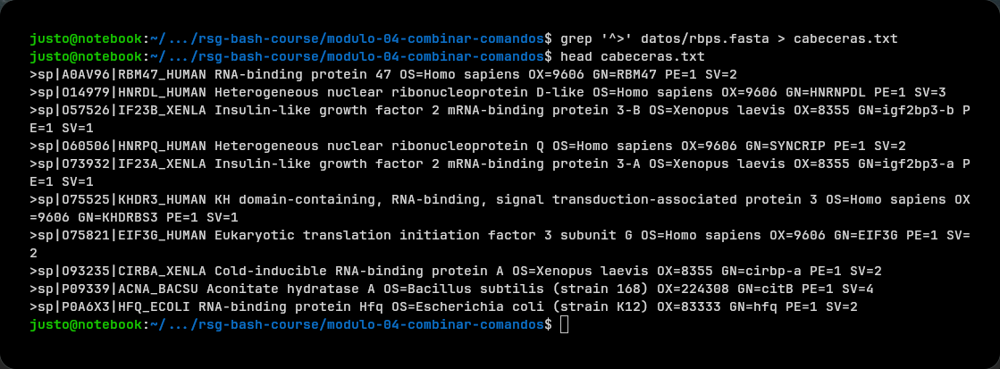
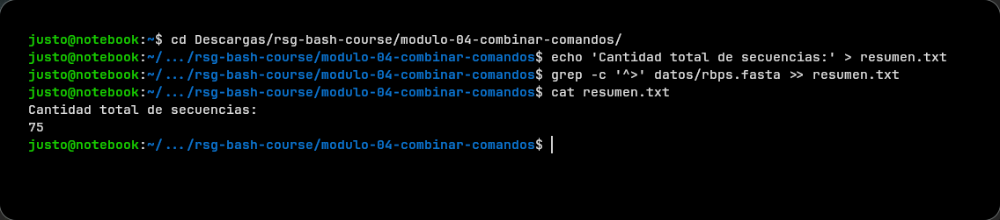
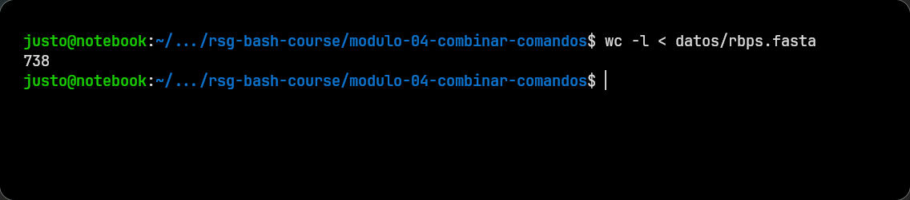
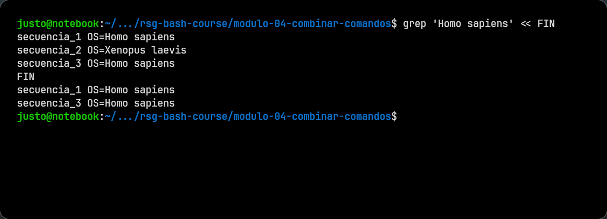
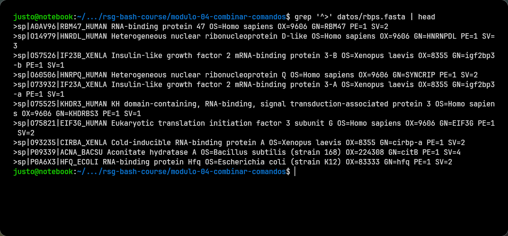
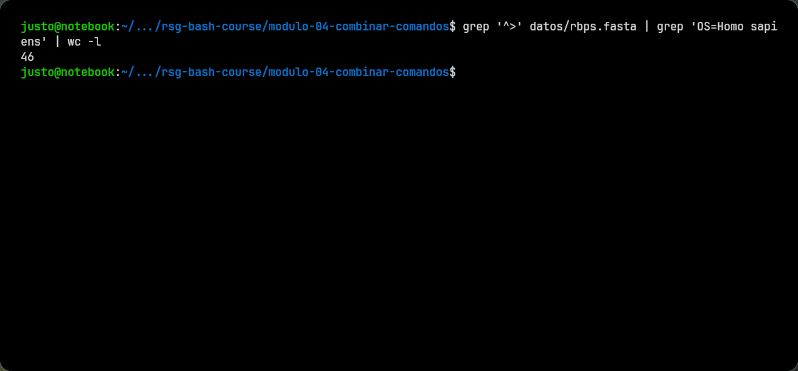

# Módulo 04: Combinar Comandos

## De comandos aislados a una tarea completa

Hasta ahora usamos la salida de los comandos para leerla en la terminal. Sin embargo, esa salida también puede convertirse en la entrada de otro comando o guardarse en un archivo para usarla más adelante.

En vez de buscar un único comando que haga todo, podemos construir una solución en pasos. Por ejemplo, para averiguar cuántas secuencias humanas contiene un archivo FASTA podemos:

1. buscar las cabeceras de las secuencias;
2. conservar solo las que pertenecen a *Homo sapiens*;
3. contar las líneas obtenidas.

Bash permite conectar estos pasos mediante redirecciones y *pipes*. Los operadores principales son:

- `>`: redirige la salida de un comando a un archivo;
- `>>`: agrega la salida al final de un archivo;
- `<`: usa un archivo como entrada de un comando;
- `<<`: proporciona varias líneas de texto como entrada de un comando;
- `|`: usa la salida de un comando como entrada del siguiente.

> [!TIP]
> Como regla mnemotécnica, se puede pensar en `>` y `<` como puntas de flecha:
>
> - `-->` apunta de izquierda a derecha: desde el comando hacia el archivo;
> - `<--` apunta de derecha a izquierda: desde el archivo hacia el comando.

## Redirección de salida con `>`

El operador `>` guarda la salida de un comando en un archivo en lugar de mostrarla en la terminal.

```bash
grep '^>' datos/rbps.fasta > cabeceras.txt
```

> [!WARNING]
> Si el archivo de destino ya existe, `>` reemplaza todo su contenido.
> 
Este comando busca las cabeceras del FASTA y las guarda en `cabeceras.txt`.

Podés comprobar el resultado con:

```bash
head cabeceras.txt
```

<details>
<summary>Ver ejecución</summary>

</details>


## Agregar contenido con `>>`

El operador `>>` también redirige la salida, pero la agrega al final del archivo sin borrar lo que ya contiene.

```bash
echo 'Cantidad total de secuencias:' > resumen.txt
grep -c '^>' datos/rbps.fasta >> resumen.txt
```

Ahora podemos verlo:

```bash
cat resumen.txt
```

<details>
<summary>Ver ejecución</summary>

La salida esperada es:

```text
Cantidad total de secuencias:
75
```
</details>


## Redirección de entrada con `<`

El operador `<` hace que un comando lea su entrada desde un archivo.

```bash
wc -l < datos/rbps.fasta
```

<details>
<summary>Ver ejecución</summary>

</details>

<br>

En este caso, `wc -l` cuenta las líneas que recibe desde `datos/rbps.fasta`.

## Entrada de varias líneas con `<<`

El operador `<<` permite escribir varias líneas que se enviarán como entrada a un comando. Después de `<<` se indica una palabra delimitadora; la entrada termina cuando esa palabra vuelve a aparecer sola en una línea.

```bash
grep 'Homo sapiens' << FIN
secuencia_1 OS=Homo sapiens
secuencia_2 OS=Xenopus laevis
secuencia_3 OS=Homo sapiens
FIN
```

<details>
<summary>Ver ejecución</summary>

</details>

## Conectar comandos con `|`

El operador `|`, llamado *pipe* o tubería, conecta la salida de un comando con la entrada del siguiente.

```bash
grep '^>' datos/rbps.fasta | head
```

<details>
<summary>Ver ejecución</summary>

</details>

<br>

En este ejemplo, `grep` extrae todas las cabeceras y `head` muestra solamente las primeras diez. Los datos pasan directamente de un comando al otro, sin crear un archivo intermedio.

Se pueden conectar más de dos comandos. Por ejemplo:

```bash
grep '^>' datos/rbps.fasta | grep 'OS=Homo sapiens' | wc -l
```

Cada comando cumple una función distinta:

1. `grep '^>'` conserva las cabeceras del FASTA;
2. `grep 'OS=Homo sapiens'` filtra las secuencias humanas (de las cabeceras del anterior);
3. `wc -l` cuenta las líneas filtradas.


<details>
<summary>Ver ejecución</summary>

</details>
<br>

Esta forma de combinar herramientas permite responder preguntas biológicas sencillas, como cuántas muestras hay, cuántas secuencias pertenecen a una especie o qué registros cumplen una condición. Cada comando hace una sola cosa y la combinación transforma la inspección manual en un análisis básico y reproducible.

## Siguiente Paso

Con estos hallazgos en mano, el paso siguiente es automatizar parte del trabajo con un script.

Seguí en el [Módulo 05: Programación en Bash](../modulo-05-programacion-bash/README.md).
